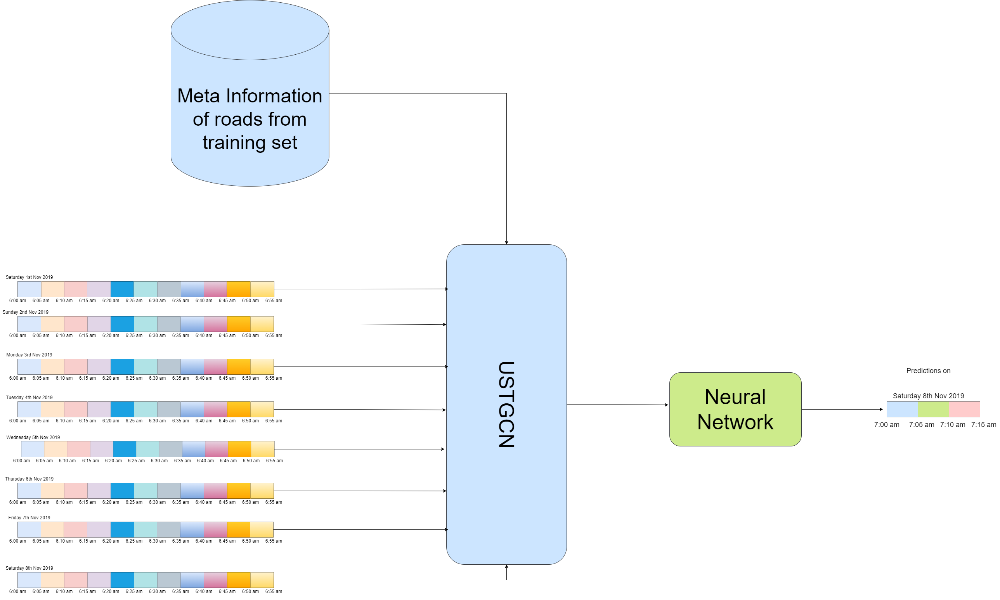
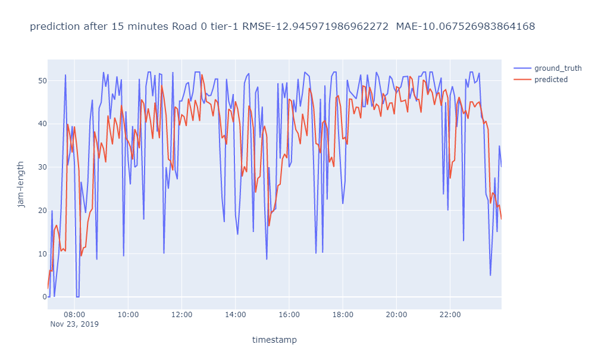

# Traffic Forecasting Using Modified USTGCN (A case study in dhaka)

### Traffic forecasting result can be found under the directories starting with 'plot_pred'

## Abstract

Deep learning models for traffic forecasting have gained a lot of success in recent years. The most important 
application in traffic domain is to predict traffic congestion after a certain time window based on historical data. 
Accurate prediction of traffic congestion results in much better traffic time delay prediction when commuting from 
one city to another city. While most of the deep learning models are evaluated using well-known traffic dataset
containing vehicle speed information generated using loop detectors, those model performances are not being tested 
on the generated traffic dataset from google maps which contains traffic density information (e.g. predicting jam 
length of each road). We demonstrate the effectiveness of Unified Spatio-temporal Graph Convolutional Network in 
forecasting traffic congestion based on the traffic data of Dhaka collected from google maps. 
We have also proposed modification of USTGCN and reported the significantly improved results achieved by 
implementing modified USTGCN. Besides that, we quantify the traffic fluctuation pattern of any road of Dhaka 
dataset by introducing a single metric (coefficient of variation of traffic density fluctuation) which can explain the 
traffic congestion fluctuation pattern within a certain time window. We have also analysed the whole traffic network of 
Dhaka using centrality measures (betweenness centrality) of Graph Theory. We have modified USTGCN framework 
based on the coefficient of variation of traffic density fluctuation and betweenness centrality of each road so that the 
modified USTGCN can generate better prediction based on the mentioned meta information for each road. Finally, the 
prediction results are compared with the original USTGCN framework and we have explained the factor behind model 
performance degradation in terms of sparsity of the datasets with which the USTGCN models are trained on.

## Traffic jam prediction sample

